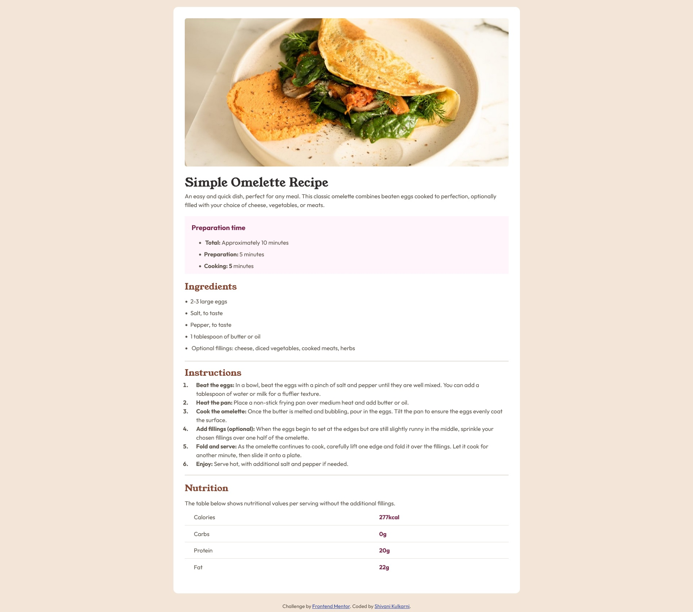

# Frontend Mentor - Recipe page solution

This is a solution to the [Recipe page challenge on Frontend Mentor](https://www.frontendmentor.io/challenges/recipe-page-KiTsR8QQKm). Frontend Mentor challenges help you improve your coding skills by building realistic projects.

## Table of contents

- [Overview](#overview)
  - [Screenshot](#screenshot)
  - [Links](#links)
- [My process](#my-process)
  - [Built with](#built-with)
  - [What I learned](#what-i-learned)
- [Author](#author)

## Overview

This is an exercise to build a Recipe Page.

### Screenshot

### Links

- Solution URL: https://github.com/shivani16kulkarni/fem-recipe-page
- Live Site URL: https://shivani16kulkarni.github.io/fem-recipe-page/

## My process

### Built with

- Semantic HTML5 markup
- CSS custom properties
- Flexbox

### What I learned

The exercise turned out to be more challenging than I expected. Even though I'm pretty comfortable with using Flexbox to organize layouts, I found myself struggling with some of the smaller details, like line heights, font family changes, font weights, and customizing lists. Working through these basics ended up being really satisfying. It helped me strengthen my grasp of the core principles and get better at CSS styling overall.

## Author

- Frontend Mentor - @shivani16kulkarni, https://www.frontendmentor.io/profile/shivani16kulkarni
